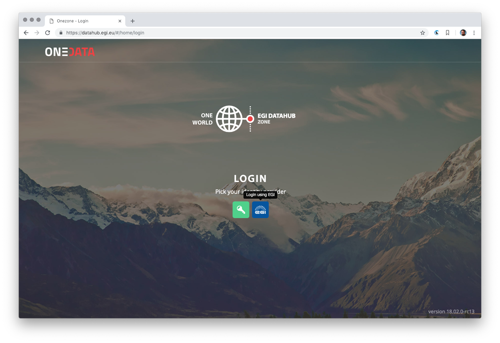
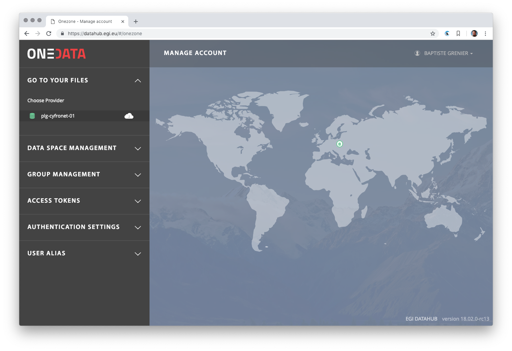
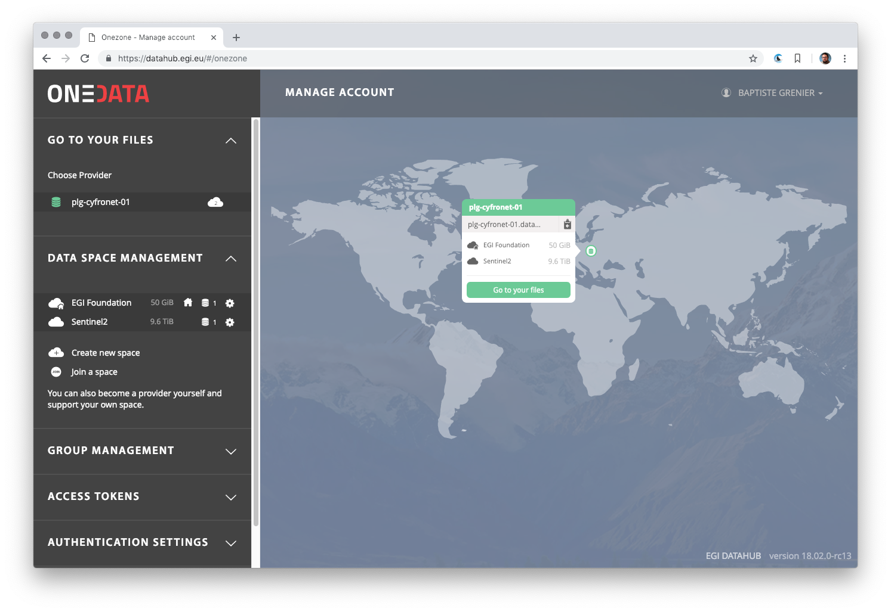
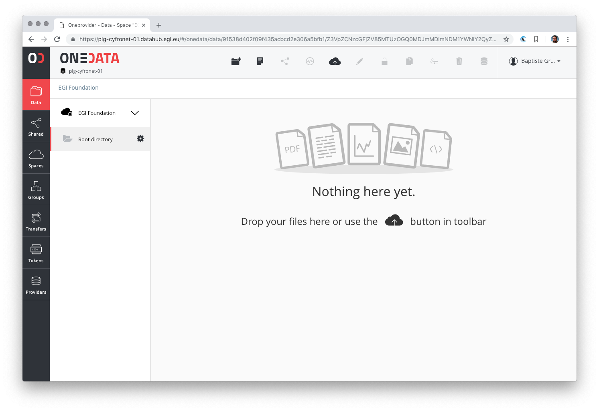
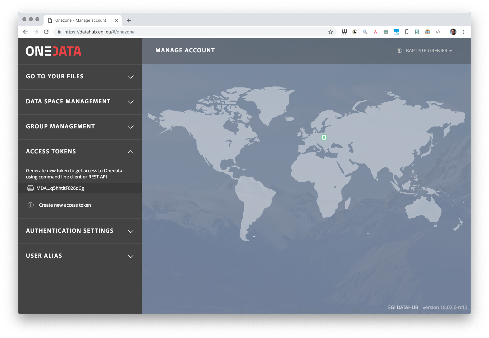

.. toctree::

Clients
-------

The `Oneclient` code and basic documentation is available on GitHub:
https://github.com/onedata/oneclient

The official documentation is:
https://onedata.org/#/home/documentation/doc/using_onedata/oneclient.html

Using the web interface
^^^^^^^^^^^^^^^^^^^^^^^

   Selecting EGI to connect using EGI Check-in

   Using EGI Check-in it's possible to connect with its institute credentials.

   EGI DataHub landing page

   On this page it's possible to have an overview of all the spaces and their
   supporting providers.

   Information about spaces supported by a Oneprovider

   On this capture, the information about the spaces supported
   by a specific provider is displayed.

   Information about spaces supported by a Oneprovider

   The data space can be managed (ie. uploading/downloading/managing files and
   metadata, manging space access) using the web browser.

.. _auth-token-using-web-interface:

Generating tokens for using Oneclient or APIs
^^^^^^^^^^^^^^^^^^^^^^^^^^^^^^^^^^^^^^^^^^^^^

.. important:: In order to be able to access your spaces using `Oneclient` or
   `APIs`, it's required to generate an access token.

Tokens have to be generated from the `DataHub` (Onezone) interface.

   Managing acccess tokens from EGI DataHub

   The access tokens can be created and managed using the EGI DataHub web interface.

Installing and testing Oneclient in a docker container
^^^^^^^^^^^^^^^^^^^^^^^^^^^^^^^^^^^^^^^^^^^^^^^^^^^^^^

A quick and simple solution for testing is to install the client on demand in a
container for a support Operating System flavor (mainly various CentOS and Ubuntu
releases).

The following variables have to be exported in the container:

* `ONECLIENT_ACCESS_TOKEN`: access token allowing to access **all** the spaces.
* `ONECLIENT_PROVIDER_HOST`: name or IP of the Oneprovider the client should connect to.

.. important:: In order to be able to use FUSE, the container should run in `privileged` mode.

.. code-block:: console

   docker run -it --privileged centos:7 /bin/bash
   root@81dbd7e84438 /]# curl -sS  http://get.onedata.org/oneclient.sh | bash
   # (...)
   Complete!
   Installation has been completed successfully.
   Run 'oneclient --help' for usage info.
   root@81dbd7e84438 /]# export ONECLIENT_ACCESS_TOKEN=<ACCESS_TOKEN_FROM_ONEZONE>
   root@81dbd7e84438 /]# export ONECLIENT_PROVIDER_HOST=plg-cyfronet-01.datahub.egi.eu
   root@81dbd7e84438 /]# mkdir /tmp/space
   root@81dbd7e84438 /]# oneclient /tmp/space
   root@81dbd7e84438 /]# ls /tmp/space

Here the data is mounted in `/tmp/space`, creating a file into it will push it
to the oneprovider and it will be accessible up in the web interface and from
other providers supporting the space.

For a real production usage it's preferable to use the Oneclient container as a
source for a volume mounted into another container.

Testing Oneclient in a Oneclient docker container with NFS or samba
^^^^^^^^^^^^^^^^^^^^^^^^^^^^^^^^^^^^^^^^^^^^^^^^^^^^^^^^^^^^^^^^^^^

Docker containers for the Oneclient are available, the existing versions can be
seen in docker hub: https://hub.docker.com/r/onedata/oneclient/tags

It's possible to use the most recent version by specifying the `latest` tag.
We also recommend using same version as shown on the Onezone and
Oneprovider pages.

The following variables have to be exported to be used in the container:

* `ONECLIENT_ACCESS_TOKEN`: access token allowing to access **all** the spaces.
* `ONECLIENT_PROVIDER_HOST`: name or IP of the Oneprovider the client should connect to.

.. important:: In order to be able to use FUSE, the container should run in `privileged` mode.

.. code-block:: console

   export ONECLIENT_ACCESS_TOKEN=<ACCESS_TOKEN_FROM_ONEZONE>
   export ONECLIENT_PROVIDER_HOST=plg-cyfronet-01.datahub.egi.eu
   docker run -it --privileged -e ONECLIENT_ACCESS_TOKEN=$ONECLIENT_ACCESS_TOKEN -e ONECLIENT_PROVIDER_HOST=$ONECLIENT_PROVIDER_HOST onedata/oneclient:18.02.0-rc13
   Connecting to provider 'plg-cyfronet-01.datahub.egi.eu:443' using session ID: '4138963898952098752'...
   Getting configuration...
   Oneclient has been successfully mounted in '/mnt/oneclient'

Now the client will run in the background and the data will now be available
through `samba/CIFS` or `nfs` protocols:

.. code-block:: console

   # Identifying the IP of the container
   docker inspect --format "{{ .NetworkSettings.IPAddress }}" $(docker ps -ql)
   172.17.0.2

So the data can be accessed at

* `smb://172.17.0.2/onedata`
* `nfs://172.17.0.2/onedata`

Testing Oneclient in a Oneclient docker container with local file access
^^^^^^^^^^^^^^^^^^^^^^^^^^^^^^^^^^^^^^^^^^^^^^^^^^^^^^^^^^^^^^^^^^^^^^^^

Another solution is to mount a local directory as a volume in the container,
allowing to access both the working directory as well as the Onedata spaces.

In order to do this we will open a `bash` shell in the container then we will
mount manually the Onedata spaces.

* `ONECLIENT_ACCESS_TOKEN`: access token allowing to access **all** the spaces.
* `ONECLIENT_PROVIDER_HOST`: name or IP of the Oneprovider the client should connect to.

.. important:: In order to be able to use FUSE, the container should run in `privileged` mode.

.. code-block:: console

   export ONECLIENT_ACCESS_TOKEN=<ACCESS_TOKEN_FROM_ONEZONE>
   export ONECLIENT_PROVIDER_HOST=plg-cyfronet-01.datahub.egi.eu
   docker run -it --privileged -e ONECLIENT_ACCESS_TOKEN=$ONECLIENT_ACCESS_TOKEN -e ONECLIENT_PROVIDER_HOST=$ONECLIENT_PROVIDER_HOST -v $PWD:/mnt/src --entrypoint bash onedata/oneclient:18.02.0-rc13
   root@aca612a84fb4:/tmp# oneclient /mnt/oneclient
   Connecting to provider 'plg-cyfronet-01.datahub.egi.eu:443' using session ID: '1641165171427694510'...
   Getting configuration...
   Oneclient has been successfully mounted in '/mnt/oneclient'.
   root@aca612a84fb4:/tmp# ls /mnt/oneclient
   (...)
   root@aca612a84fb4:/tmp# ls /mnt/src
   (...)

Now it's possible to use the following mount points:

* `/mnt/oneclient`: the Onedata spaces
* `/mnt/src`: the local directory (any absolute path could have been used
  instead of `$PWD` that points to the working directory)

Testing Oneclient in a Virtual Machine
^^^^^^^^^^^^^^^^^^^^^^^^^^^^^^^^^^^^^^

The following variables have to be exported:

* `ONECLIENT_ACCESS_TOKEN`: access token allowing to access **all** the spaces.
* `ONECLIENT_PROVIDER_HOST`: name or IP of the Oneprovider the client should connect to.

.. code-block:: console

   curl -sS http://get.onedata.org/oneclient.sh | bash
   export ONECLIENT_ACCESS_TOKEN=<ACCESS_TOKEN_FROM_ONEZONE>
   export ONECLIENT_PROVIDER_HOST=plg-cyfronet-01.datahub.egi.eu
   mkdir /tmp/space
   oneclient /tmp/space

Testing Oneclient in a Vagrant box
^^^^^^^^^^^^^^^^^^^^^^^^^^^^^^^^^^

It's possible to quickly test Oneclient using `Vagrant <https://www.vagrantup.com/>`_.

The following variables have to be exported:

* `ONECLIENT_ACCESS_TOKEN`: access token allowing to access **all** the spaces.
* `ONECLIENT_PROVIDER_HOST`: name or IP of the Oneprovider the client should connect to.

.. code-block:: console

   vagrant init ubuntu/xenial64
   vagrant up
   vagrant ssh
   curl -sS http://get.onedata.org/oneclient.sh | bash
   export ONECLIENT_ACCESS_TOKEN=<ACCESS_TOKEN_FROM_ONEZONE>
   export ONECLIENT_PROVIDER_HOST=plg-cyfronet-01.datahub.egi.eu
   mkdir /tmp/space
   oneclient /tmp/space
