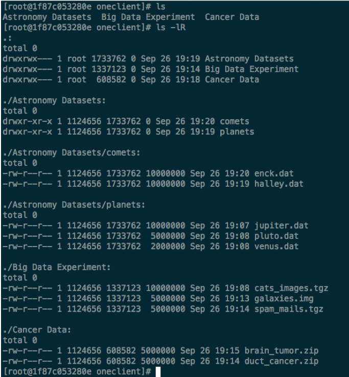

.. toctree::

Introduction
------------

Motivation
``````````

* Putting up a (scalable) distributed data infrastructure needs specific expertise, resources and knowledge
* No easy way to discover and transfer data
* No easy way of making data (publicly) accessible without transferring it a sharing service
* No easy way of combining multiple datasets from different data providers
* Users need to access data locally and from compute resources

Components and concepts
```````````````````````

* :Space: a virtual volume where users will organize their data. A space is
  supported by one or multiple Oneproviders providing actual storage resources

:Onezone: a central component federating providers, it will take care of AAI
  and other management tasks (like space creation). EGI DataHub is a Onezone
  instance.

:Oneprovider: a service that will provide storage resources to spaces. A
  Oneprovider is typically deployed at a site near the local storage resources,
  and can access local storage resources over multiple connectors (CEPH,
  POSIX,...). A default Oneprovider is also connected to the EGI DataHub

:EGI DataHub: a Onedata Onezone, the federation and authentication service. SSO
              with all the connected storage providers (Oneprovider) through
              EGI Check-in
:Oneprovider: data management component deployed in the data centres,
              provisioning data and managing transfers. A default one is
              operated for EGI by CYFRONET.
:Space: a virtual volume where users organize data. A space is supported by one
        or multiple Oneproviders
:Oneclient: a client providing access to the spaces through a FUSE mount point
            (local POSIX access)

            Web interfaces and APIs are also available

:Oneclient: a client application allowing to access a space and mount it as a
  local file system. Oneclient can be used from VM, containers, desktop,...
  Other access is also possible via web interface or REST APIs.


Highlighted features
````````````````````


   Viewing a data space using the EGI DataHub web interface

   Using the EGI DataHub web interface it's possible to manage the space.



   Viewing a data space in a console locally mounted using Oneclient

   Using Oneclient it's possible to mount a space locally, and access it over a
   POSIX interface, using files as they were storred locally. The file's blocks
   are downloaded on demand.


   Viewing file distribution over the Oneproviders

   In Onedata the file distribution is dong on a block basis, blocks will be
   replicated on the fly, and it's possible to instrutmentize the replication.


   Management of metadata using the web interface

   Three different format of metadata can be attached to files: basic
   (key/value), JSON and RDF. The metadata can be managed using the Web
   interface and the APIs. It's also possible to create indexes and query them.


   Viewing file popularity for smart caching

   It's possible to view the popularity of a file and manage smart caching.
